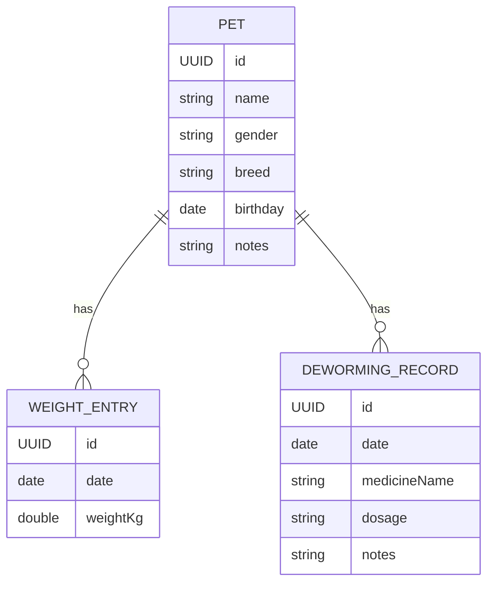

# 数据模型设计（本地持久化为主）

## 1. 实体与关系
- Pet（宠物）
  - id: UUID
  - name: String
  - gender: String (enum: male/female/unknown)
  - breed: String
  - birthday: Date?
  - photo: Data?/URL?（先用占位，后续再定）
  - notes: String?
- WeightEntry（体重记录）
  - id: UUID
  - date: Date
  - weightKg: Double（单位 kg，统一由 UI 做单位转换）
  - pet: Pet（多对一）
- DewormingRecord（驱虫记录）
  - id: UUID
  - date: Date
  - medicineName: String
  - dosage: String?（可选文本，如“半片/体表滴剂”等）
  - notes: String?
  - pet: Pet（多对一）

### Mermaid ER 图


## 2. 关键约束与校验
- name 非空；gender 使用受限枚举
- weightKg > 0；同一天多条体重时按创建时间排序
- 驱虫日期不得晚于当前日期（或允许未来日期用于提醒，需一致策略）

## 3. Swift 示例（DTO，用于 ViewModel）
```swift
struct PetDTO: Identifiable, Equatable {
    let id: UUID
    var name: String
    var gender: Gender
    var breed: String
    var birthday: Date?
    var notes: String?
}

enum Gender: String, CaseIterable, Codable { case male, female, unknown }

struct WeightEntryDTO: Identifiable, Equatable {
    let id: UUID
    var date: Date
    var weightKg: Double
    var petId: UUID
}

struct DewormingRecordDTO: Identifiable, Equatable {
    let id: UUID
    var date: Date
    var medicineName: String
    var dosage: String?
    var notes: String?
    var petId: UUID
}
```

## 4. 单位与可视化
- 统一存储为 kg；显示时可切换 lb（转换：1 kg ≈ 2.20462 lb）
- 图表：X 轴为日期，Y 轴为体重；按月/周聚合可选

## 5. 迁移与扩展
- 新增字段（如绝育状态、芯片号）时在 Core Data 增加新版本
- 可新增 VaccineRecord 实体（未来阶段）

## 6. 新增：称重会话（临时状态，不持久化）
- 目的：在“所有宠物体重面板”中点击“开始称重”，进入会话，一次性为所有宠物逐个录入体重
- 特性：仅为 UI 会话状态；提交时才写入 WeightEntry；会话关闭不保留未提交输入
- 状态模型与交互详见 ux_design.md

## 7. 导出 JSON 结构（用于设置页导出）
- 文件命名：`PetRecord-YYYYMMDD.json`
- 示例结构：
```json
{
  "version": 1,
  "exportedAt": "2025-08-10T12:00:00Z",
  "pets": [
    {
      "id": "UUID",
      "name": "Milo",
      "gender": "male",
      "breed": "Shiba Inu",
      "birthday": "2023-05-01",
      "notes": null,
      "weights": [
        { "id": "UUID", "date": "2025-08-01", "weightKg": 9.6 }
      ],
      "dewormings": [
        { "id": "UUID", "date": "2025-07-01", "medicineName": "Broadline", "dosage": null, "notes": null }
      ]
    }
  ]
}
```
- 说明：
  - `version` 便于未来格式升级
  - 日期建议用 `YYYY-MM-DD` 或 ISO8601；App 内部保持统一

## 2. 表单与校验（新增说明）
- 新增/编辑 Pet：
  - 必填：name；可选：gender、breed、birthday、notes
  - 校验：name 非空且长度合理（1–50）；birthday 不晚于当前日期
- 新增 WeightEntry：
  - 默认日期：今天；必填：weightKg（>0）
  - 错误消息：在字段下方显示；不阻塞其他页面
- 新增 DewormingRecord：
  - 默认日期：今天；必填：medicineName；可选：dosage、notes

## 3. 预置/演示数据策略
- UI 开发阶段可在 Preview 中使用 `previewStore()` 生成只用于预览的静态数据
- 运行态与交互逻辑中不再使用随机/自动写入；全部通过手动表单新增

## 4. 导出 JSON（保持不变）
- 结构与命名规范同前文；与编辑/新增不冲突
