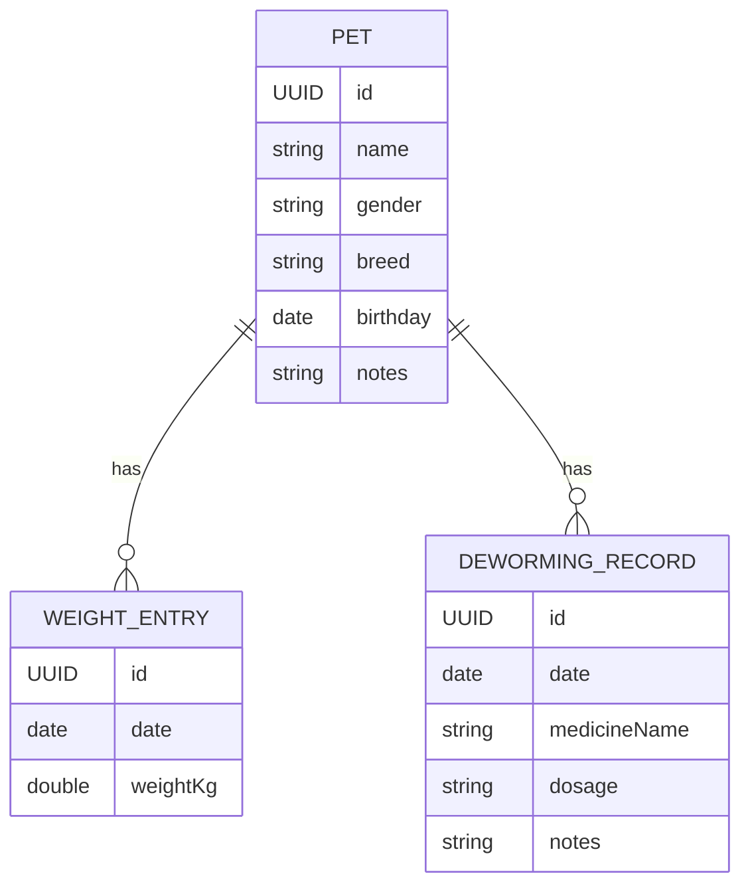

# 数据模型设计（本地持久化为主）

## 1. 实体与关系
- Pet（宠物）
  - id: UUID
  - name: String
  - gender: String (enum: male/female/unknown)
  - breed: String
  - birthday: Date?
  - photo: Data?/URL?（先用占位，后续再定）
  - notes: String?
- WeightEntry（体重记录）
  - id: UUID
  - date: Date
  - weightKg: Double（单位 kg，统一由 UI 做单位转换）
  - pet: Pet（多对一）
- DewormingRecord（驱虫记录）
  - id: UUID
  - date: Date
  - medicineName: String
  - dosage: String?（可选文本，如“半片/体表滴剂”等）
  - notes: String?
  - pet: Pet（多对一）

### Mermaid ER 图


## 2. 关键约束与校验
- name 非空；gender 使用受限枚举
- weightKg > 0；同一天多条体重时按创建时间排序
- 驱虫日期不得晚于当前日期（或允许未来日期用于提醒，需一致策略）

## 3. Swift 示例（DTO，用于 ViewModel）
```swift
struct PetDTO: Identifiable, Equatable {
    let id: UUID
    var name: String
    var gender: Gender
    var breed: String
    var birthday: Date?
    var notes: String?
}

enum Gender: String, CaseIterable, Codable { case male, female, unknown }

struct WeightEntryDTO: Identifiable, Equatable {
    let id: UUID
    var date: Date
    var weightKg: Double
    var petId: UUID
}

struct DewormingRecordDTO: Identifiable, Equatable {
    let id: UUID
    var date: Date
    var medicineName: String
    var dosage: String?
    var notes: String?
    var petId: UUID
}
```

## 4. 单位与可视化
- 统一存储为 kg；显示时可切换 lb（转换：1 kg ≈ 2.20462 lb）
- 图表：X 轴为日期，Y 轴为体重；按月/周聚合可选

## 5. 迁移与扩展
- 新增字段（如绝育状态、芯片号）时在 Core Data 增加新版本
- 可新增 VaccineRecord 实体（未来阶段）
