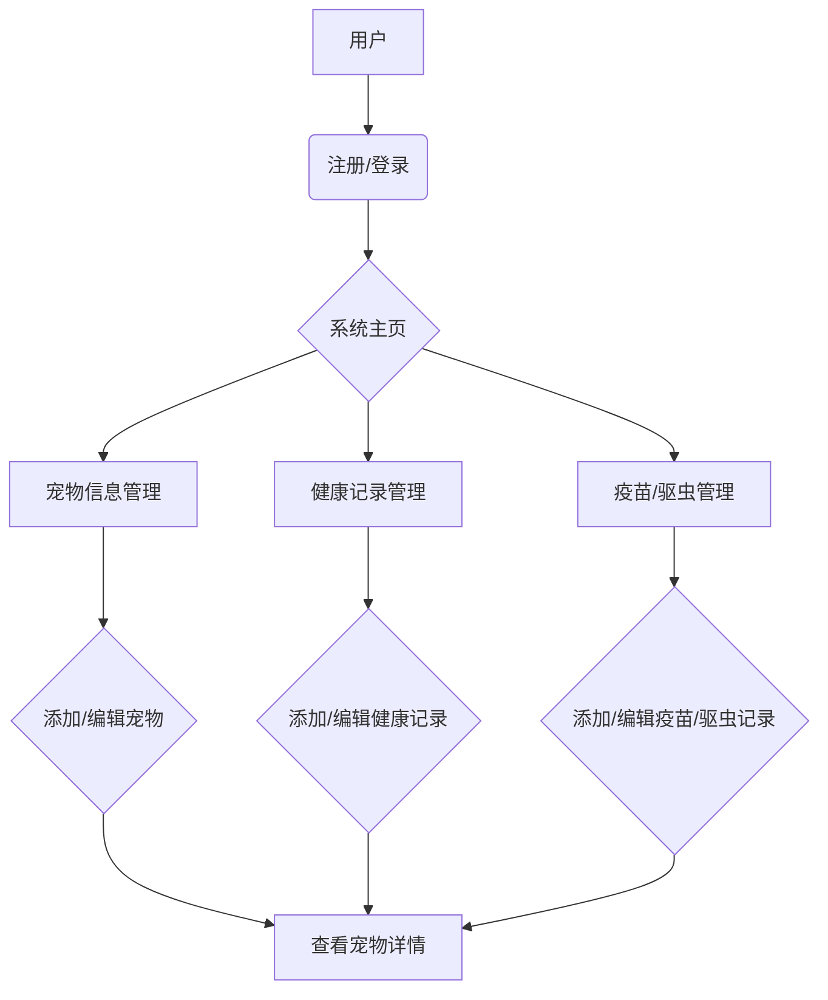

# 项目计划

## 1. 项目目标

开发一个宠物记录管理系统，方便用户记录宠物的基本信息、健康状况、疫苗接种、驱虫等信息。

## 2. 核心功能模块

-   **宠物信息管理：** 记录宠物的姓名、种类、生日、性别、照片等。
-   **健康记录：** 记录体检、疾病、用药等健康相关信息。
-   **疫苗管理：** 记录疫苗种类、接种日期、下次接种日期提醒。
-   **驱虫管理：** 记录驱虫药物、驱虫日期、下次驱虫日期提醒。
-   **用户管理：** 注册、登录、个人信息管理。

## 3. 开发流程概览 (Mermaid Flowchart)

## 4. 迭代计划

### 阶段一：核心功能开发 (MVP)

-   用户注册与登录
-   宠物信息录入与查看
-   简单的健康记录录入

### 阶段二：功能完善

-   疫苗和驱虫记录管理及提醒
-   健康记录详情和图表展示
-   用户个人信息修改

### 阶段三：扩展功能

-   宠物社交功能
-   宠物服务推荐
-   数据备份与恢复

## 5. 风险与挑战

-   数据安全与隐私保护
-   用户体验优化
-   多平台兼容性
